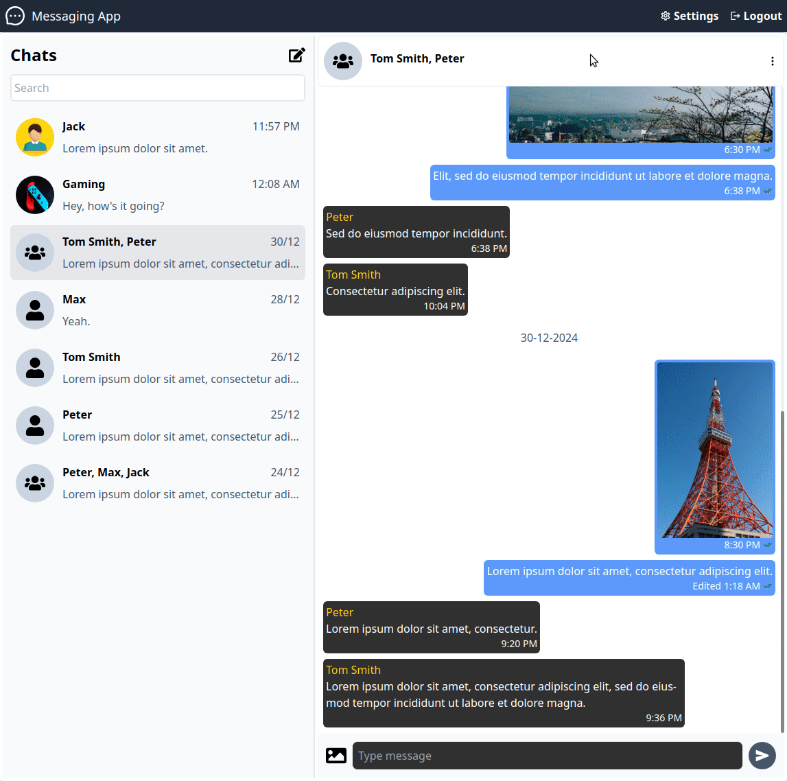

# Odin Project #27: Messaging App (frontend)

The goal of this Odin Project assignment was to create a full-stack messaging application. This repo contains the front-end that was built with React and TypeScript.

The back-end was built with Express (and other tools) and can be found in [this repo](https://github.com/BrightNeon7631/odin-messaging-app-backend). It contains a more thorough documentation that covers all the RESTful API endpoints.

I started and finished this project around December 2024 / January 2025.

## Assignment

[The Odin Project - NodeJS - #27 Messaging App](https://www.theodinproject.com/lessons/nodejs-messaging-app)

## Technology

- TypeScript
- React
- React Router
- React Hook Form
- Zod
- Tailwind CSS
- Vite
- Axios
- JWT decode

### Additional NPM packages
- date-fns
- react-icons
- react-spinners

## Key Concepts

- TypeScript: static vs dynamic typing
- Single-page apps
- Client-side routing
- BrowserRouter & Routes: createBrowserRouter(), createRoutesFromElements() & RouterProvider
- Route, path & element
- Layout Route & Outlet
- Protected routes
- Link & NavLink: navigation, active styling, state & useLocation()
- JWT Decode: decoding JWT tokens client-side (validation takes place server-side)
- Consuming REST APIs in React: fetch vs axios, setting the authorization header, performing requests, handling errors, updating state
- useEffect: side effects, syntax, dependencies array, async functions, fetching data from the API, Local Storage
- Context: useContext, createContext, context provider, passing values
- React Hook Form & Zod: validating form data, defining form types & form schema, error handling, zodResolver (integrates Zod with React Hook Form)

## Features

- The user can create a new account or log in to an existing one. User data can be updated.
- The user can browse existing conversations and create or update them.
- The user can add or update messages. 

## Links

[Back-end Repo](https://github.com/BrightNeon7631/odin-messaging-app-backend)

## Screenshots

### Desktop





### Mobile


## Image sources

- <a href="https://www.freepik.com/free-vector/businessman-character-avatar-isolated_6769264.htm">Image by studiogstock</a> on Freepik
- https://unsplash.com/photos/J_C3_JpJMms by Filiz Elaerts
- https://unsplash.com/photos/Dq_txpbAcZY by あま あわれ
- https://images.unsplash.com/photo-1617096200347-cb04ae810b1d

## Deployment

You may need to change the axios base url in the .env or main.tsx.

```bash
# clone repo
git clone https://github.com/BrightNeon7631/odin-messaging-app-frontend.git

# install project dependencies
npm install

# run vite dev server
npm run dev

# create a production build
npm run build
```